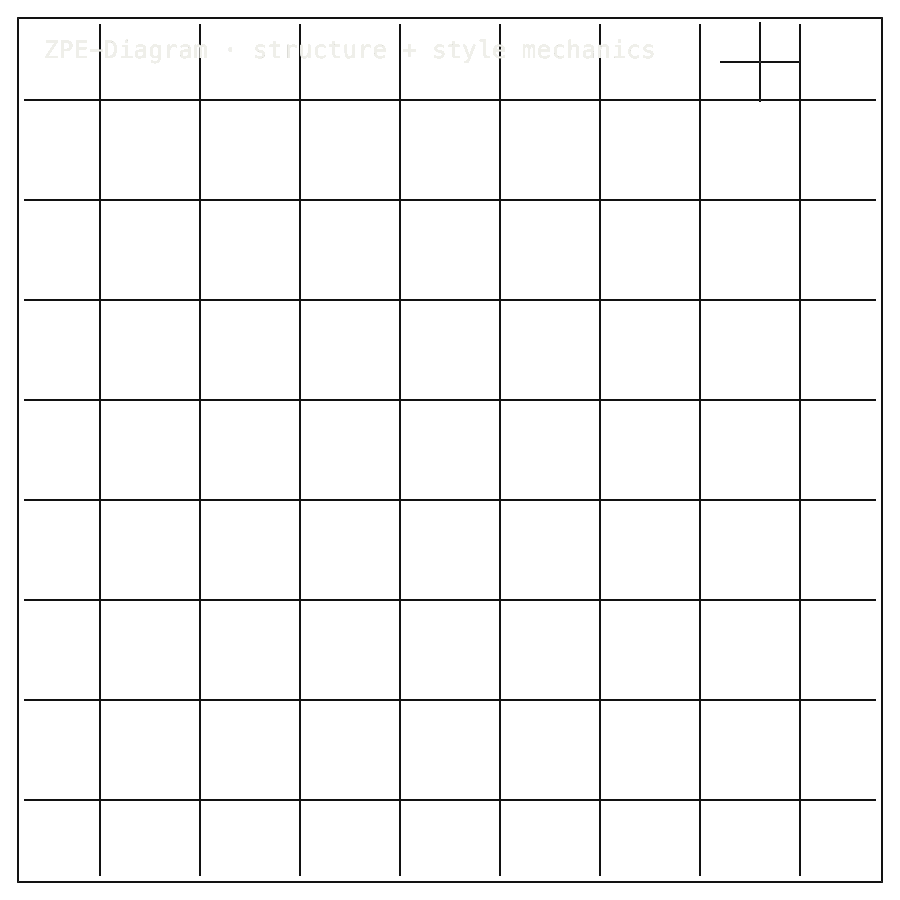

# ZPE-Diagram

## Package Install

Installable package: `python3.11 -m pip install zpe-diagram`.
Current release: `0.1.0` on [PyPI](https://pypi.org/project/zpe-diagram/).
Source: [Zer0pa/ZPE-Diagram](https://github.com/Zer0pa/ZPE-Diagram/).

```bash
python3.11 -m pip install zpe-diagram
```

For full install, smoke, source, and developer commands, [click here](#install-developer-commands-detailed).

---

<table width="100%">
<tr>
<td width="100%" valign="top">
<div><span><b>00 · ZPE-DIAGRAM</b> · GRAPH-STRUCTURE</span> <span>RESEARCH-READY · PYPI CONNECTED</span></div>
      <h1>Encoding The <span>Grammar Of Diagrams</span></h1>
      <p>Bounded structural diagram codec · ZPE-Diagram · PyPI <em>zpe-diagram</em> v0.1.0 · github.com/Zer0pa/ZPE-Diagram</p>
      <p>Most diagram exports flatten a structured drawing into a picture. Six declared synthetic SVGs round-trip through ZPE-Diagram as explicit graph state &mdash; geometry, color, stroke width, and draw order all exact. Three out-of-scope probes &mdash; fills, dashed strokes, palette escapes &mdash; are refused at the door instead of silently approximated. This is <em>not</em> compression and <em>not</em> a general SVG renderer. It is a bounded codec that keeps the rules that make a diagram readable as a diagram.</p>
</td>
</tr>
</table>

<table width="100%">
<tr>
<td width="100%" valign="top">
<figure>
        <div></div>
        <figcaption><b>Scope:</b> bounded synthetic SVG grammar. Structure, style, and order round-trip; general SVG rendering is outside scope.</figcaption>
      </figure>
</td>
</tr>
</table>

<table width="100%">
<tr>
<td width="100%" valign="top">
<div><b>01 · THE GAP</b> <span>LOST IN EXPORT</span></div>
      <h2>A diagram exported as an image loses the grammar that made it a diagram.</h2>
</td>
</tr>
</table>

<table width="100%">
<tr>
<td width="100%" valign="top">
<div><b>02 · MARKETS</b> <span>WEDGE MAP</span></div>
      <div>
        <div>
          <div><span>Diagramming software</span>  <span>$1.9B</span></div>
          <div><span>Graphic design software</span>  <span>$85.5B</span></div>
          <div><span>Technical documentation tooling</span>  <span>$4.8B</span></div>
          <div><span>Standards-body technical drawing</span>  <span>$0.8B</span></div>
          <div><span>Document archival software</span>  <span>$7.3B</span></div>
        </div>
      </div>
      <div>Diagramming and adjacent archival categories &middot; <strong>the wedge is line-based technical drawings, not the whole graphic design market</strong>.</div>
</td>
</tr>
</table>

<table width="100%">
<tr>
<td width="50%" valign="top">
<div><b>03 · VALUE OF MARKET</b></div>
      <div><span>$1.9B</span> <span>2030</span></div>
      <div>Diagramming software by 2030; ZPE-Diagram keeps line-based drawings <b>readable as drawings after export</b>.</div>
</td>
<td width="50%" valign="top">
<div><b>04 · INSIGHT</b></div>
      <h2>A diagram's grammar is the draw order, <span>not the pixels.</span></h2>
</td>
</tr>
</table>

<table width="100%">
<tr>
<td width="50%" valign="top">
<div><b>05.1 · CURRENT TECH</b> <span>PIXELS ONLY</span></div>
        <p>Standard diagram exports preserve appearance, not intent. The file shows lines in roughly the right place while losing the structural roles, the connection types, and the order in which a person actually built the drawing.</p>
</td>
<td width="50%" valign="top">
<div><b>05.2 · OUR TECH</b> <span>KEEP THE GRAMMAR</span></div>
        <p>ZPE-Diagram keeps the grammar. On <strong>six declared synthetic line-based SVGs</strong>, geometry, a frozen eight-color palette, quantized stroke width, and draw order all round-trip exactly. Three out-of-scope probes &mdash; fills, dashed strokes, palette escapes &mdash; are <strong>rejected at encode time</strong> rather than silently coerced into something they are not.</p>
</td>
</tr>
</table>

<table width="100%">
<tr>
<td width="100%" valign="top">
<div><b>05.3 · BENCHMARKS</b> <span>VALIDATION</span></div>
      <div>
        <div>
          <div><span>Cases</span><b>6</b><small>SVGs</small></div>
          <div><span>Structure</span><b>1.000</b><small>exact</small></div>
          <div><span>Style</span><b>1.000</b><small>exact</small></div>
          <div><span>Order</span><b>1.000</b><small>exact</small></div>
        </div>
        <div>
          <div><span>structure</span>  <span>1.000</span></div>
          <div><span>style</span>  <span>1.000</span></div>
          <div><span>reject</span>  <span>3 / 3</span></div>
        </div>
      </div>
      <div><b>Source:</b> <em>bounded_style_validation.json</em> &middot; <strong>6/6 in-scope at 1.000 &middot; 3/3 out-of-scope refused</strong>.</div>
</td>
</tr>
</table>

<table width="100%">
<tr>
<td width="34%" valign="top">
<div><b>06 · MEASUREMENT</b> <span>BOUNDED VALIDATION</span></div>
      <h2>Six in-scope cases verified; three out-of-scope probes <span>refused at encode.</span></h2>
</td>
<td width="66%" valign="top">
<div><b>06.1 · BOUNDED VALIDATION</b> <span>SYNTHETIC SVG FIXTURES</span></div>
      <div>
        <div>
          <div><span>Structure</span>  <span>1.000</span></div>
          <div><span>Style (color + stroke)</span>  <span>1.000</span></div>
          <div><span>Draw order</span>  <span>1.000</span></div>
          <div><span>Out-of-scope reject</span>  <span>3 / 3</span></div>
        </div>
      </div>
      <div>Six declared synthetic SVGs (triangle &times;2, square, parallel bars &times;2, T-mixed) plus three reject probes (fill, dash, palette escape). Source: <b>validation/results/bounded_style_validation.json</b>. No comparator codec evaluated.</div>
</td>
</tr>
</table>

<table width="100%">
<tr>
<td width="100%" valign="top">
<div><b>07 · KEY METRICS</b> <span>BOUNDED STRUCTURAL CODEC</span></div>
</td>
</tr>
</table>

<table width="100%">
<tr>
<td width="100%" valign="top">
<div><b>07.1 · STRUCTURAL FIDELITY</b></div>
      <div>6<span>/ 6</span></div>
      <div>Synthetic cases &middot; <b>structure, style, draw-order all exact</b></div>
</td>
</tr>
</table>

<table width="100%">
<tr>
<td width="100%" valign="top">
<div><b>07.2 · OUT-OF-SCOPE REJECT</b></div>
      <div>3<span>/ 3</span></div>
      <div>Probes refused &middot; <b>fill &middot; dash &middot; palette escape</b></div>
</td>
</tr>
</table>

<table width="100%">
<tr>
<td width="100%" valign="top">
<div><b>07.3 · RELEASE</b></div>
      <div>v0.1.0</div>
      <div>PyPI connected &middot; <b>zpe-diagram 0.1.0</b></div>
</td>
</tr>
</table>

<table width="100%">
<tr>
<td width="100%" valign="top">
<div><b>07.4 · CHECKED PACKET</b></div>
      <div>VERIFIED</div>
      <div>Public validation packet &middot; <b>bounded synthetic scope</b></div>
</td>
</tr>
</table>

<table width="100%">
<tr>
<td width="100%" valign="top">
<div><b>07.5 · COMPRESSION CLAIM</b></div>
      <div>none</div>
      <div>Not a compression codec &middot; <b>structure preserved, not file size</b></div>
</td>
</tr>
</table>

<table width="100%">
<tr>
<td width="100%" valign="top">
<div><b>08 · DETERMINISM</b> <span>COMMITTED FIXTURES</span></div>
      <h2>Committed fixtures. <span>Same bounded metrics.</span></h2>
</td>
</tr>
</table>

<table width="100%">
<tr>
<td width="66%" valign="top">
<div><b>08.1 · WHAT DETERMINISTIC MEANS</b> <span>FIXTURES + REJECTS</span></div>
      <p>Grammar here means something precise: the rules that make a drawing readable as a diagram rather than a pile of lines. Geometry encodes where elements sit. Style encodes how connections differ. Draw order encodes the sequence in which a person placed them. ZPE-Diagram keeps all three axes on committed fixtures and replays them byte-for-byte. On the bounded surface of six declared synthetic SVGs, structural, style, and draw-order fidelity each measure <strong>1.000</strong> &mdash; and the three out-of-scope probes never enter the packet.</p>
</td>
<td width="34%" valign="top">
<div><b>08.2 · THE FIDELITY GAP</b></div>
      <span>Honest Blocker &middot;</span>
      <p><strong>No fill encode path. No dash encode path. No arbitrary SVG coverage. No compression claim.</strong> The current evidence is six synthetic fixtures plus three out-of-scope rejects. Real-world corpus closure, the <em>is_diagram_header()</em> boundary profile, and stroke-width normalization beyond the synthetic packet all remain open work.</p>
</td>
</tr>
</table>

<table width="100%">
<tr>
<td width="33%" valign="top">
<div><b>09</b> </div>
      <h2>DIAGRAMS WITH A <span>RECEIPT.</span></h2>
</td>
<td width="67%" valign="top">
<div><b>09.1 &middot; THE AMBITION</b></div>
      <p>The ambition is to make exported diagrams behave like the structured objects their authors meant them to be: archivable, comparable, searchable by structure rather than by pixel. A docs team, a standards committee, or an engineering archive should be able to trust that the drawing they store is the drawing they later retrieve.</p>
</td>
</tr>
</table>

<table width="100%">
<tr>
<td width="33%" valign="top">
<div><b>09.2 &middot; WHAT WORKS NOW</b></div>
        <h2>Working today, on six declared synthetic SVGs: geometry, style, and draw order survive encoding exactly.</h2>
</td>
<td width="67%" valign="top">
<div><b>09.3 &middot; WHAT'S STILL OPEN</b></div>
        <h2>Still open: public corpora, header-boundary profile, and stroke-width handling outside the synthetic packet.</h2>
</td>
</tr>
</table>

<table width="100%">
<tr>
<td width="100%" valign="top">
<div><b>09.4</b> &middot; DOCS · NEAR-TERM (12–24 MO)</div>
      <div>Docs teams keep diagram meaning</div><div>A documentation team that exports a system diagram no longer ships a flat picture. The export carries node positions, line roles, and draw order, so the next writer can update the diagram instead of redrawing it from scratch.</div>
</td>
</tr>
</table>

<table width="100%">
<tr>
<td width="100%" valign="top">
<div><b>09.5</b> &middot; PIPELINES · NEAR-TERM (12–24 MO)</div>
      <div>Pipelines refuse the wrong input</div><div>An archival pipeline that ingests diagrams now receives either a clean bounded object or a clear refusal. The operations team stops debugging silent visual corruption later and starts seeing rejection reasons at the moment of ingest.</div>
</td>
</tr>
</table>

<table width="100%">
<tr>
<td width="100%" valign="top">
<div><b>09.6</b> &middot; STANDARDS · MID-TERM (24–48 MO)</div>
      <div>Standards bodies archive structure, not screenshots</div><div>ISO, IEEE, and ANSI technical drawing submissions can travel as structural objects with geometry, color, and draw order intact. A standards committee can compare two revisions of a wiring diagram or process flow without arguing about which export tool rendered it.</div>
</td>
</tr>
</table>

<table width="100%">
<tr>
<td width="100%" valign="top">
<div><b>09.7</b> &middot; DIFFS · MID-TERM (24–48 MO)</div>
      <div>Diagram review moves off pixel overlays</div><div>Two versions of an architecture diagram become a structural diff: which boxes moved, which lines changed role, which elements were reordered. Reviewers stop squinting at overlaid screenshots and start reading change lists they can talk about in meetings.</div>
</td>
</tr>
</table>

<table width="100%">
<tr>
<td width="100%" valign="top">
<div><b>09.8</b> &middot; PROVENANCE · PARADIGM (48 MO+)</div>
      <div>Drawings acquire chain-of-custody</div><div>A technical drawing in a regulatory submission, an engineering archive, or a patent filing can be proven identical or different across decades. Drawings stop being images and become governed structural objects that survive the people, vendors, and tools that produced them.</div>
</td>
</tr>
</table>

---

<a id="install-developer-commands-detailed"></a>

## Install / Developer Commands Detailed

<!-- INSTALL-DX:START -->
#### Package Install

Installable package: `python3.11 -m pip install zpe-diagram`.
Current release: `0.1.0` on [PyPI](https://pypi.org/project/zpe-diagram/).
Source: [Zer0pa/ZPE-Diagram](https://github.com/Zer0pa/ZPE-Diagram/).

```bash
python3.11 -m pip install zpe-diagram
```

Import smoke:

```bash
python3.11 - <<'PY'
import importlib.metadata as md
import zpe_diagram

print("zpe-diagram", md.version("zpe-diagram"))
PY
```

Install success only proves package acquisition/import. Product scope, stale PyPI state, platform limits, and blockers remain in the front-door sections below.<!-- INSTALL-DX:END -->

#### Quick Start

```bash
python3 -m venv .venv
. .venv/bin/activate
python -m pip install --upgrade pip
python -m pip install -e ".[dev]"
python proofs/artifacts/reproduce_validation.py
python -m pytest tests/test_style_authority.py
```
